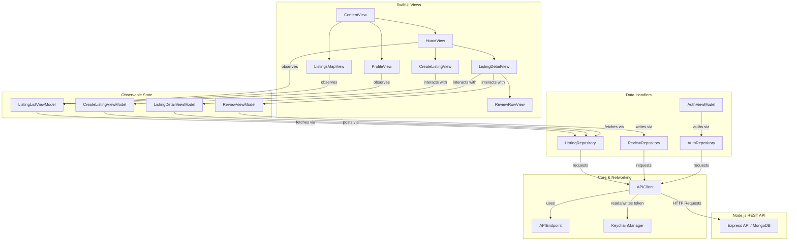

<p align="center">
  
</p>

<h1 align="center">🏡 TripNest</h1>

<p align="center">
  A premium, high-fidelity iOS travel booking and accommodation application built natively with <b>SwiftUI</b> and <b>MapKit</b>.
</p>

<p align="center">
  
  
  
  
  
</p>

---

## ✨ Features

- **🔐 Premium Authentication Flow**
  - Sleek, modern [LoginView](file:///Users/vedantdubey_20/TripNest/Views/Auth/LoginView.swift) and [RegisterView](file:///Users/vedantdubey_20/TripNest/Views/Auth/RegisterView.swift) interfaces.
  - Secure credential storage using **iOS Keychain Services** via the custom [KeychainManager](file:///Users/vedantdubey_20/TripNest/Core/Storage/KeychainManager.swift).
  
- **🔍 Browse & Filter Stays**
  - A beautiful, fluid explore feed ([HomeView](file:///Users/vedantdubey_20/TripNest/Views/Home/HomeView.swift)) with smooth grid animations.
  - Instant text search (by city, country, or title) powered by [ListingListViewModel](file:///Users/vedantdubey_20/TripNest/ViewModels/ListingListViewModel.swift).
  - Horizontal category scroll selectors with dynamic gradient highlights.
  - Native pull-to-refresh data updates.

- **🗺️ Interactive Map Exploration**
  - Live map overlay ([ListingsMapView](file:///Users/vedantdubey_20/TripNest/Views/Map/ListingsMapView.swift)) presenting property coordinates with custom MapKit annotations.

- **🏡 Listing Detail Spotlights**
  - High-fidelity [ListingDetailView](file:///Users/vedantdubey_20/TripNest/Views/Detail/ListingDetailView.swift) screens.
  - Custom [ImageCarouselView](file:///Users/vedantdubey_20/TripNest/Views/Detail/ImageCarouselView.swift) with swipe transitions.
  - Comprehensive listing metadata details (host info, pricing, description).

- **✍️ Community Feedback & Reviews**
  - Dedicated [ReviewRowView](file:///Users/vedantdubey_20/TripNest/Views/Detail/ReviewRowView.swift) item styles.
  - Fully integrated options to submit or delete user feedback.

- **➕ Host Listing Creator**
  - Interactive property publisher ([CreateListingView](file:///Users/vedantdubey_20/TripNest/Views/Create/CreateListingView.swift)).
  - Interactive inputs including title, description, price, location, country, and image uploads.

---

## 🏗️ Architecture & Data Flow

TripNest is engineered using the **Model-View-ViewModel (MVVM)** design pattern, promoting clean separation of concerns and robust data flow.



---

## 📁 Project Structure

Here is a look at how the codebase is structured for local workspace access:

* 📦 **[Package.swift](file:///Users/vedantdubey_20/TripNest/Package.swift)** — Swift Package Manager manifest defining compilation targets.
* 🛠️ **[generate_xcodeproj.py](file:///Users/vedantdubey_20/TripNest/generate_xcodeproj.py)** — Automatically configures the local Xcode workspace layout.
* 🚀 **[App/](file:///Users/vedantdubey_20/TripNest/App)** — Entry points and core view wrappers.
  * [TripNestApp.swift](file:///Users/vedantdubey_20/TripNest/App/TripNestApp.swift) — The main application structure.
  * [ContentView.swift](file:///Users/vedantdubey_20/TripNest/App/ContentView.swift) — Orchestrates authenticated tab routing.
* 🧬 **[Core/](file:///Users/vedantdubey_20/TripNest/Core)** — Storage managers and network execution clients.
  * [Network/APIClient.swift](file:///Users/vedantdubey_20/TripNest/Core/Network/APIClient.swift) — Asynchronous URLSession handler.
  * [Network/APIEndpoint.swift](file:///Users/vedantdubey_20/TripNest/Core/Network/APIEndpoint.swift) — Type-safe router for API paths.
  * [Storage/KeychainManager.swift](file:///Users/vedantdubey_20/TripNest/Core/Storage/KeychainManager.swift) — Keychain helper for token security.
* 💾 **[Models/](file:///Users/vedantdubey_20/TripNest/Models)** — Core data objects.
  * [Listing.swift](file:///Users/vedantdubey_20/TripNest/Models/Listing.swift) | [User.swift](file:///Users/vedantdubey_20/TripNest/Models/User.swift) | [Review.swift](file:///Users/vedantdubey_20/TripNest/Models/Review.swift)
* 💼 **[ViewModels/](file:///Users/vedantdubey_20/TripNest/ViewModels)** — Logic wrappers representing state.
  * [ListingListViewModel.swift](file:///Users/vedantdubey_20/TripNest/ViewModels/ListingListViewModel.swift) — Handles listings feeds, filters, and searches.
  * [AuthViewModel.swift](file:///Users/vedantdubey_20/TripNest/ViewModels/AuthViewModel.swift) — Coordinates registration/login flow.
* 🎨 **[Views/](file:///Users/vedantdubey_20/TripNest/Views)** — Declarative SwiftUI user interface modules.

---

## 🚀 Getting Started

### Prerequisites
* **macOS** with **Xcode 15.0+** installed.
* **Python 3** (to execute project generation).
* A running **TripNest Backend Server** (Node.js REST API).

### 1. Set Up the Backend Endpoint
By default, the client directs queries to `http://localhost:3000/api`. To direct the client to your specific local machine IP or custom server, update `baseURLString` inside:
👉 **[Core/Network/APIEndpoint.swift](file:///Users/vedantdubey_20/TripNest/Core/Network/APIEndpoint.swift)**

```swift
static var baseURLString: String = "http://YOUR_SERVER_IP:3000/api"
```

### 2. Generate the Xcode Project
TripNest uses a Python generator to build an `.xcodeproj` container for development. Run the generator script in the root folder:

```bash
python3 generate_xcodeproj.py
```

This generates `TripNest.xcodeproj` in the workspace root.

### 3. Build & Run
1. Open **`TripNest.xcodeproj`** in Xcode.
2. Select the `TripNest` executable target and choose an iOS 17+ Simulator or connected device.
3. Build and run using `⌘ + R`!
