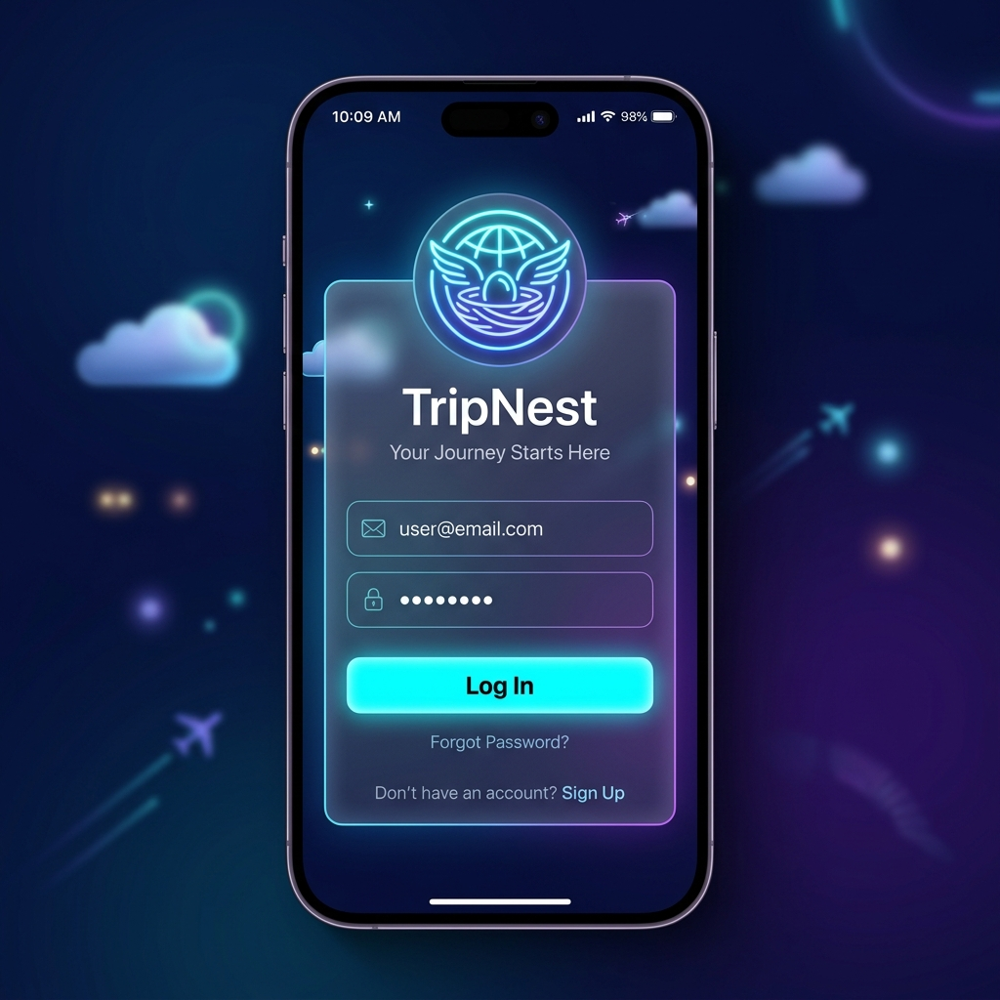
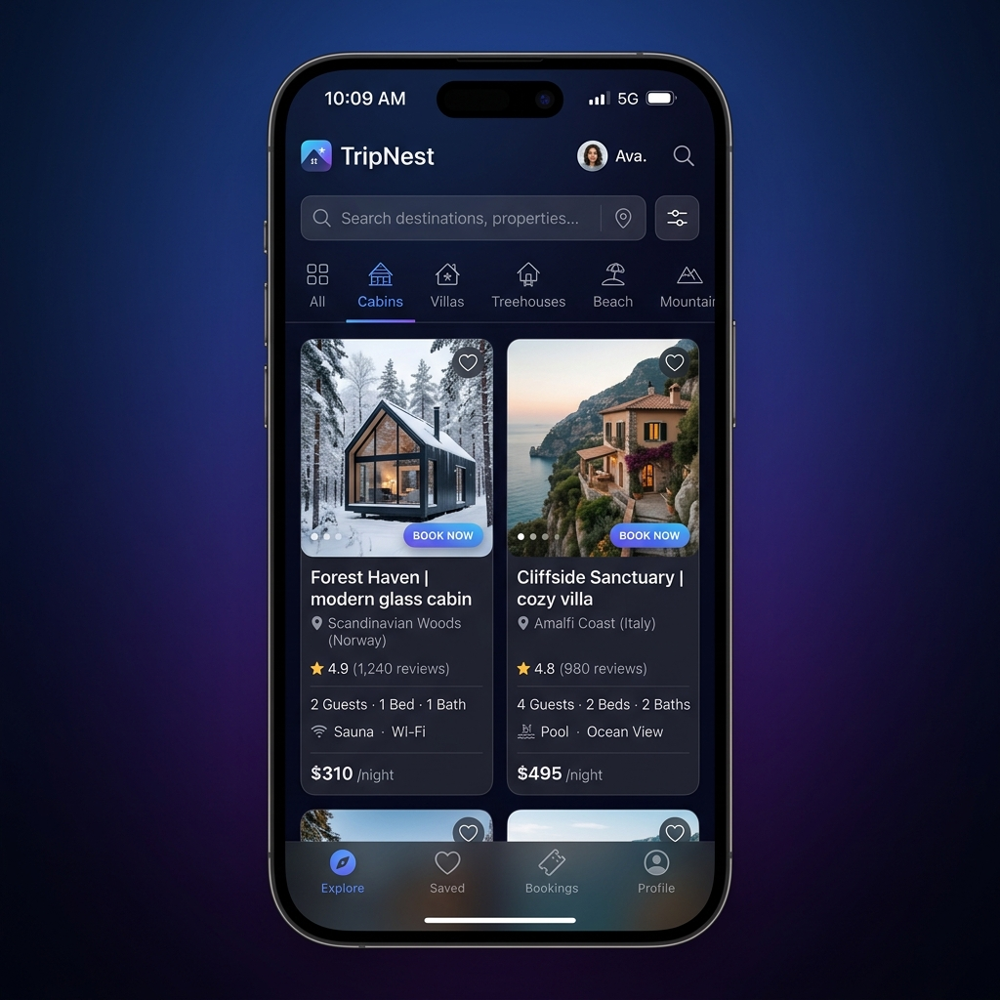
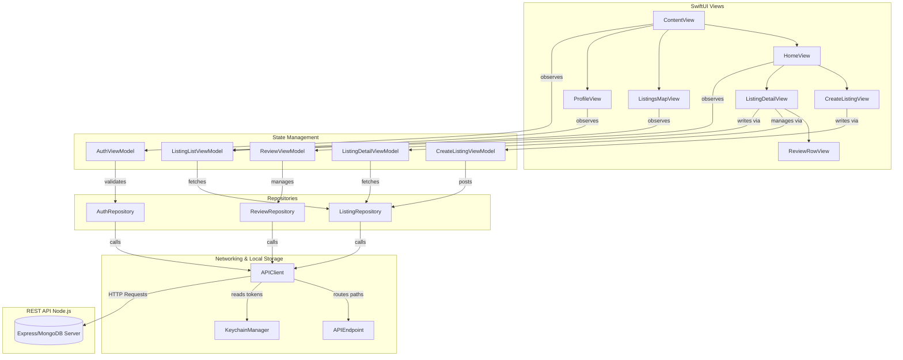

<p align="center">
  
</p>

<h1 align="center">🏡 TripNest</h1>

<p align="center">
  <b>A premium, high-fidelity iOS travel booking and accommodation application built natively with SwiftUI, MapKit, and Swift Package Manager.</b>
</p>

<p align="center">
  
  
  
  
  
</p>

---

## ✨ Design & Visual Philosophy

TripNest is crafted with a focus on high-fidelity user experiences, leveraging modern design patterns:
* 🌌 **Sleek Dark Mode Theme**: Fully locked into a luxurious dark color palette featuring vibrant glowing accents, high-contrast text hierarchies, and deep blue-indigo backdrops.
* 🔮 **Glassmorphism**: Login cards and dialog overlays utilize premium `.ultraThinMaterial` backgrounds overlaid with translucent borders and soft glowing shadows.
* ⚡ **Micro-Animations**: Grid displays, page navigation views, and list selection states feature smooth transitions and scale feedback animations for responsive touch interactions.

<p align="center">
  
  
</p>

---

## 🚀 Key Features

* 🔐 **Secure Authentication**
  * Premium, responsive [LoginView](file:///Users/vedantdubey_20/TripNest/Views/Auth/LoginView.swift) and [RegisterView](file:///Users/vedantdubey_20/TripNest/Views/Auth/RegisterView.swift).
  * Hardware-backed storage using iOS Keychain Services via the custom [KeychainManager](file:///Users/vedantdubey_20/TripNest/Core/Storage/KeychainManager.swift).
* 🔍 **Browse & Filter Listings**
  * Modern explore feed ([HomeView](file:///Users/vedantdubey_20/TripNest/Views/Home/HomeView.swift)) with dynamic category horizontal sliders and listing thumbnails.
  * Instant search filtering by city, country, or listing title powered by [ListingListViewModel](file:///Users/vedantdubey_20/TripNest/ViewModels/ListingListViewModel.swift).
* 🗺️ **Interactive Maps**
  * Native [ListingsMapView](file:///Users/vedantdubey_20/TripNest/Views/Map/ListingsMapView.swift) interface.
  * Custom MapKit pin annotations showing listed properties with direct access to details.
* 📖 **Interactive Details & Spotlights**
  * Detailed property pages ([ListingDetailView](file:///Users/vedantdubey_20/TripNest/Views/Detail/ListingDetailView.swift)) with an image paging carousel, detailed specifications, and host profiles.
* ✍️ **Reviews & Feedback**
  * Integrated [ReviewRowView](file:///Users/vedantdubey_20/TripNest/Views/Detail/ReviewRowView.swift) items.
  * Ability for authenticated users to post new reviews or delete their own feedback.
* ➕ **Become a Host**
  * Publish new properties directly inside the app using the [CreateListingView](file:///Users/vedantdubey_20/TripNest/Views/Create/CreateListingView.swift) form (title, address, price, description, and preview image upload).

---

## 🏗️ Architecture & Data Flow

The project is structured under the **Model-View-ViewModel (MVVM)** architecture pattern, separating data handling, business logic, and UI display.



---

## 📁 Directory Structure

```bash
TripNest/
├── App/
│   ├── Assets.xcassets/         # App icons & brand logos
│   ├── ContentView.swift        # Main route controller
│   └── TripNestApp.swift        # iOS App Entry Point
├── Core/
│   ├── Network/
│   │   ├── APIClient.swift      # URLSession networking wrapper
│   │   └── APIEndpoint.swift    # API route compiler
│   └── Storage/
│       └── KeychainManager.swift# Secure Token Storage
├── Models/                      # Decodable models (User, Listing, Review)
├── ViewModels/                  # Views state logic
├── Views/                       # SwiftUI files
│   ├── Auth/                    # Login & Registration
│   ├── Create/                  # List a Property
│   ├── Detail/                  # Carousel details & Reviews
│   ├── Home/                    # Listings Feed
│   └── Map/                     # Custom MapKit search
├── TripNest.xcodeproj/          # Compiled project configurations
├── Package.swift                # SPM target configurations
└── generate_xcodeproj.py        # Python project generator script
```

---

## 🚀 Getting Started

### 1. Set Up the Backend
Ensure you have a running TripNest Backend Server (Express/MongoDB API). Update the endpoint IP in [APIEndpoint.swift](file:///Users/vedantdubey_20/TripNest/Core/Network/APIEndpoint.swift):
```swift
static var baseURLString: String = "http://YOUR_LOCAL_SERVER_IP:3000/api"
```

### 2. Generate Xcode Project
The codebase maintains a lightweight footprint by generating the Xcode project layout dynamically. Re-generate the project container before building:
```bash
python3 generate_xcodeproj.py
```

### 3. Build & Run
1. Open the generated `TripNest.xcodeproj` workspace in Xcode.
2. Select the `TripNest` scheme.
3. Choose an iOS simulator (iOS 17+) and hit `⌘ + R` to compile and run!

### 4. Build via SPM CLI (Alternative)
For validation or command-line developer setups, you can compile target libraries directly:
```bash
swift build
```

---

## 👥 Creator

* 👤 **Vedant Dubey** - [GitHub Profile](https://github.com/vedantdubey19)

---

## 📄 License
This project is licensed under the MIT License. See LICENSE for details.
